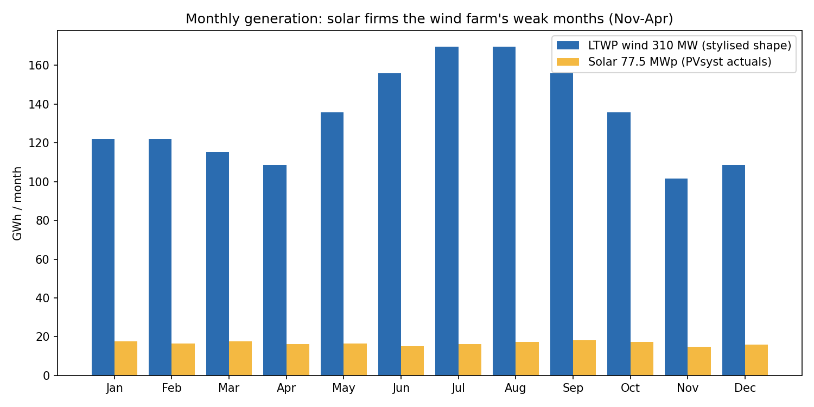
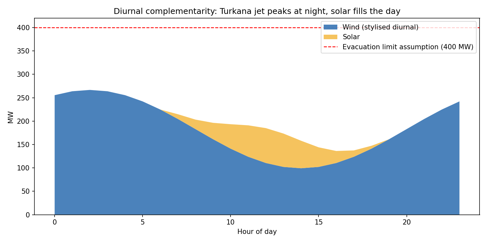

# LTWP Solar Integration — Hybridising Kenya's Largest Wind Farm

Can a 77.5 MWp solar plant co-located with Lake Turkana Wind Power (310 MW) add
energy **without new transmission**, and does it stand up commercially? This repo
combines actual PVsyst simulation results with a hybrid complementarity and
curtailment analysis, and an honest scenario-based LCOE.

## Design (PVsyst simulation, actuals in `data/`)

| Parameter | Value |
|---|---|
| Solar capacity | 77.50 MWp / 74.62 MWac |
| Annual energy to grid | **199.3 GWh (P50)** |
| Performance ratio | 86.2% |
| Specific yield | ~2,572 kWh/kWp (Turkana is an exceptional solar site) |

## Why hybridise: the complementarity case




1. **Diurnal:** the Turkana low-level jet blows hardest at night; solar fills the
   daytime trough. The stylised combined peak (~267 MW) stays well below a
   400 MW evacuation assumption — **solar re-uses interconnection the wind farm
   already paid for**, the single biggest cost advantage of this project.
2. **Seasonal:** wind output sags November–April, exactly when irradiance holds
   steady. Hybrid output is materially flatter — worth real money to a grid
   operator managing evening hydro dispatch.
3. **Infrastructure leverage:** roads, O&M base, substation and the 400 kV
   Loiyangalani–Suswa line exist. Marginal integration cost is close to panels +
   inverters + a new bay.

## LCOE — corrected, with scenarios

An earlier version of this analysis quoted €0.0194/kWh from the PVsyst economic
module. That figure ignores discounting and is not defensible in front of a
lender. Recomputed (10% real discount rate, 0.5%/yr degradation, $0.75/W CAPEX,
$10/kW-yr OPEX, 25 yrs):

| Scenario | Energy sold (GWh/yr) | LCOE (USD/kWh) |
|---|---|---|
| Base (P50) | 199.3 | **0.037** |
| P90 yield | 189.4 | 0.039 |
| CAPEX +20% | 199.3 | 0.044 |
| Curtailment 10% | 179.4 | 0.042 |
| Combined downside | 170.4 | **0.052** |

Even the combined downside clears typical Kenyan solar procurement levels. The
economics are robust; **the risks are commercial, not technical.**

## What a lender would challenge (bankability layer)

- **Offtake:** is solar sold under the existing LTWP PPA, a new PPA, or merchant?
  Kenya Power's payment record and the deemed-energy treatment of the *existing*
  PPA are the gating items — LTWP's own history of transmission-delay deemed
  energy payments is the cautionary tale here.
- **Curtailment allocation:** if the system operator curtails the hybrid site,
  which technology backs down first, and who is compensated? Must be explicit
  in the grid-connection agreement.
- **Evacuation limit:** the 400 MW limit used here is an assumption to test, not
  a datum — the real number is a KETRACO/system-operator study output.
- **Yield basis:** debt sized on P90 (~189 GWh); the table shows the spread.
- **Storage option:** a 2–4 hr battery would shift solar into the evening peak
  and firm the deemed-energy position; worth a follow-on case once time-of-day
  pricing signals exist.

## Run it

```bash
pip install -r requirements.txt
python hybrid_analysis.py
```

Reads `data/PVsyst_Simulation_Results.csv` (real simulation output), writes
charts and the scenario table to `outputs/`. Wind monthly/diurnal shapes are
**stylised** from the known behaviour of the Turkana jet and scaled to LTWP's
published ~1.6 TWh/yr — swap in metered data to harden the curtailment result.

## Repository structure

```
data/       PVsyst simulation results (CSV) + feasibility report (PDF)
docs/       technical reports
images/     PVsyst output graphs
pv_design/  PVsyst project files
outputs/    generated charts + scenario tables
hybrid_analysis.py
```
